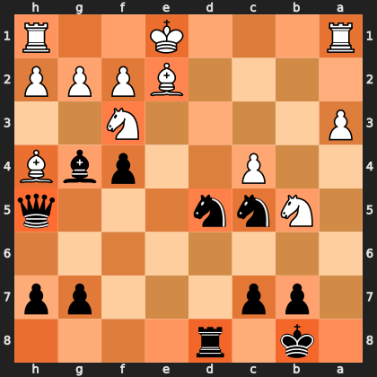
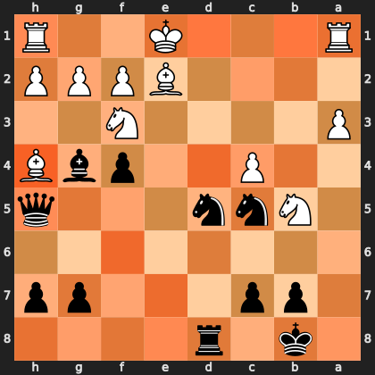

# The mirror in the machine

### A reference-frame bug in reading a chess transformer's attention

When you read activations out of a neural network, you are translating between
two coordinate systems: the one the network thinks in, and the one you think in.
If those disagree and nothing crashes, you get a plausible picture of nothing.

This is a short account of such a bug — how it hid, what it cost, and how it was
caught. The subject is **BT3**, a Leela Chess Zero network: a 15-layer
transformer with 24 attention heads per layer, which treats each of the 64
squares as a token and therefore produces a 64×64 attention matrix per head.

---

## Reading attention out of BT3

The network ships as ONNX. Converted to a PyTorch module tree, its encoder
blocks appear as named submodules — `module.encoder{i}/mha/QK/softmax` for
*i* = 0…14. Extraction is then a matter of hooks: register a forward hook on
each of the fifteen, run one forward pass under `torch.no_grad()`, and let the
hooks capture the post-softmax attention tensors, each of shape
`[batch, heads, 64, 64]`.

Averaging over layers, heads and queries collapses that to a single number per
square: *how much attention this square receives*. Project it back onto a board
and you have a picture of where the network is looking.

That last step — "project it back onto a board" — is the whole bug.

---

## The bug

Leela does not encode the board the way you read it. It encodes it **from the
perspective of the side to move**. For a white-to-move position, internal token
0 is a1. For a black-to-move position, the board is flipped first, so internal
token 0 is the square *black* sees in that corner.

The original mapping did this:

```python
for i in range(64):
    sq = f"{files[i % 8]}{ranks[i // 8]}"   # i=0 -> a1, always
    saliency_map[sq] = saliency_vec[i]
```

Index 0 is a1. Always. Which is right exactly half the time.

For every black-to-move position, the resulting heatmap was **reflected through
the horizontal axis** — a1↔a8, e4↔e5, h2↔h7. The fix evaluates the mirrored
position and maps the ranks back explicitly:

```python
eval_fen = board.mirror().fen() if board.turn == chess.BLACK else board.fen()
...
if is_black:
    saliency_map = {sq[0] + str(9 - int(sq[1])): v for sq, v in saliency_map.items()}
```

Measured across 40 black-to-move positions, the mean per-square residual between
the buggy map and the rank-flipped corrected map is **0.0003** on a [0,1] scale
(median 0.0002, max 0.0007). The two are the same map, reflected. That number is
the bug's signature.

---

## Why it survived

Nothing about the broken output looks broken.

The heatmaps were smooth and plausible. Attention concentrated in a few places,
fell off elsewhere, and produced the sort of image you nod at. No exception, no
NaN, no failing test — a unit test comparing the map against itself passes
regardless of frame. Every value was in range; every square existed.

It was also right half the time. White-to-move positions were correct
throughout, so any spot-check that happened to land on one confirmed the code.

This is the characteristic shape of a coordinate-frame error, and it is not
specific to machine learning. It is the same failure as a sign convention
inverted in an ocean model, or a genomic interval that is 1-based in one file
format and 0-based in the next: the pipeline runs, the output is the right shape
and the right magnitude, and it is silently about a different thing than you
believe. The unit tests cannot help, because the units are all correct.

---

## What it cost: one position

The position below is from a real bullet game — [lichess.org/1Wvn4QYp](https://lichess.org/1Wvn4QYp),
Center Game, Kieseritzky Variation (C21), 20 July 2026, Black to move on move 19.

```
1k1r4/1pp3pp/8/1Nnn3q/2P2pbB/P4N2/4BPPP/R3K2R b KQ - 1 19
```

White's king is still on e1 with both rooks undeveloped on a1 and h1. Black's
king sits on b8 behind the b7/c7 pawns, with a queen on h5, two knights on the
c5/d5 outposts, and a bishop on g4.

**Corrected (absolute frame) — the six most-attended squares:**

| square | attention | occupant |
|---|---:|---|
| h5 | 1.000 | **Black queen** |
| b8 | 0.864 | **Black king** |
| d8 | 0.859 | Black rook |
| f3 | 0.765 | White knight — *pinned by the g4 bishop* |
| d5 | 0.748 | Black knight |
| e2 | 0.670 | White bishop — *behind the pin* |

Six for six occupied. The attention sits on the queen leading the attack, the
king it is aimed at, the rook that is about to join, and — pointedly — on both
ends of the pin down the e2/f3 diagonal.

**Buggy (side-to-move frame) — the six most-attended squares:**

| square | attention | occupant |
|---|---:|---|
| h4 | 1.000 | White bishop |
| b1 | 0.865 | *empty* |
| d1 | 0.859 | *empty* |
| f6 | 0.766 | *empty* |
| d4 | 0.749 | *empty* |
| e7 | 0.670 | *empty* |

One for six. Five of the network's six most-attended squares have nothing on
them at all.




*Left: absolute frame. Right: the same tensors, mirrored. Both boards shown from
Black's side; heat is attention received.*

The broken map is a confident claim that a 15-layer transformer is devoting its
peak attention to squares with nothing on them. Stated that way it is absurd.
Rendered as a smooth orange heatmap, it looked like insight.

---

## The second bug, which this write-up found

An earlier version of this post used different figures. They were wrong, and the
way they were wrong is worth more than the original finding.

BT3's input is not a board. It is **112 planes**, of which roughly 84 encode the
previous eight positions. The extraction code built its input from a bare FEN —
so every one of those history planes was empty, and the network was being fed
something it never sees in play.

The tell came from the value head. On 20 midgame positions it returned
`value = -1.000` with `wdl = [0, 0, 1]` — total, certain loss — on positions
that were nothing of the kind, while the LC0 binary running *the same weights*
returned sharp, sensible evaluations. The starting position looked perfectly
fine, because its true history genuinely is empty. That coincidence is what let
this survive.

Fixing it moved the attention maps by 0.11–0.20 per square, with only one to
three of the top five squares surviving. Two orders of magnitude larger than the
frame bug's signature, and it invalidated the figures I had already published.

There is a trap inside the fix, too. `Board.mirror()` returns a board with an
**empty move stack**, so mirroring a black-to-move position into the
white-to-move frame silently throws the history away a second time. The mirrored
frame has to be rebuilt by replaying mirrored moves.

The frame finding itself survives all of this untouched: both maps come from a
single forward pass, so the reflection between them is a fact about coordinates,
not about input quality. Re-measured on properly-fed inputs, the residual is
still 0.0003. But the *reading* of the old figures — which squares the network
cared about — was a description of a degenerate forward pass.

---

## How it was actually caught

Not by a test. By asking a question the code could not answer for itself:
*if the network is any good, its attention should land on squares that matter —
so does it?*

For white-to-move positions it plainly did. For black-to-move positions the
attention kept landing on empty squares, while the pieces actually deciding the
game went unattended. One position could be noise. The pattern held across every
black-to-move position I looked at, and the mirror symmetry between the two sets
was the tell.

The general form of this check is worth stating, because it generalises past
chess: **hold the model fixed and vary the thing your code treats as
incidental.** Here the incidental thing was whose turn it was. If a
representation you have extracted changes character when you flip a variable
that should not matter — or fails to change when it should — the bug is in your
extraction, not in the model.

---

## The fix, and its boundary

The correction did not replace the old function. It sits alongside it:

- `saliency()` — original, frame-relative, retained and **documented as unsafe**
  for position analysis.
- `saliency_absolute(fen)` — absolute frame, correct for both sides. Everything
  downstream is required to call this one.

Two functions with an explicit boundary beat one function with a comment. The
old behaviour is still reachable for anyone who genuinely wants the network's
own frame, and the name of the safe one says what it guarantees. A batched
variant, `saliency_absolute_batch`, applies the same correction to *N* positions
in a single forward pass.

---

## What this is and isn't

This is activation capture — reading internal attention weights via forward
hooks, the same mechanism libraries like TransformerLens expose for
interpretability work. It is not gradient saliency; there is no backward pass.

It is also not causal. Nothing here ablates a head, patches an activation, or
demonstrates that the attention on e1 is *load-bearing* for the network's
evaluation. Attention weights are correlational evidence about what a model
attends to, not proof of what it uses — a distinction worth keeping sharp,
because the natural next step is to test it: ablate the heads that carry the
king-square attention and see whether the evaluation moves.

That is the experiment this bug was blocking. Half the data was mirrored, so no
intervention result would have meant anything.

---

## The transferable part

The interesting content of this bug is not chess. It is that a model-analysis
pipeline can be *wrong in a way that is invisible to every automated check you
would normally write*, and the only thing standing between you and a confident
false result is domain reasoning about whether the output makes sense.

Which is the same discipline as any other kind of scientific computing: do not
trust a number because it has the right shape and the right units. Trust it when
you understand the mechanism that produced it.

---

*Code: [`backend/neural_vision.py`](https://github.com/thejusmahajan/chess_speak_out_loud)
— `_attention_saliency` (frame-relative), `saliency_absolute` (corrected frame),
`_input_board` (history-bearing input, including the mirrored replay).
Network: BT3-768x15x24h-swa-2790000. All figures regenerated from forward passes
carrying the game's real 37-ply history.*
